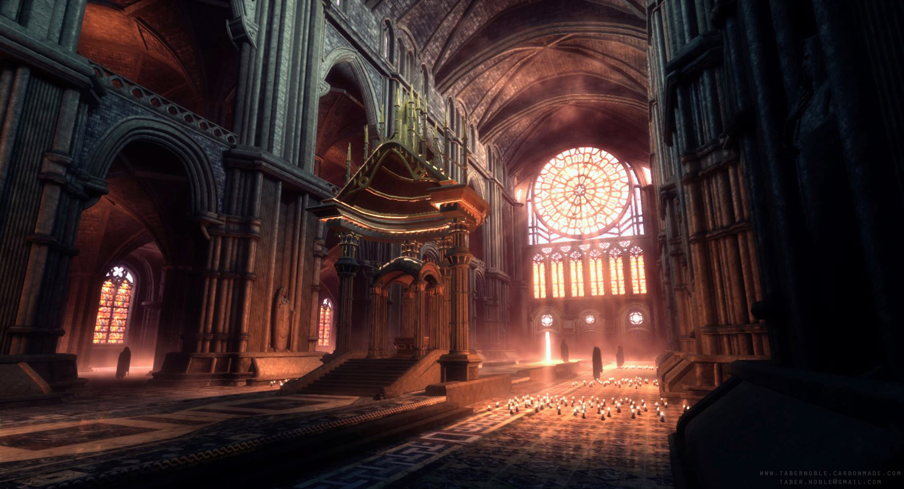
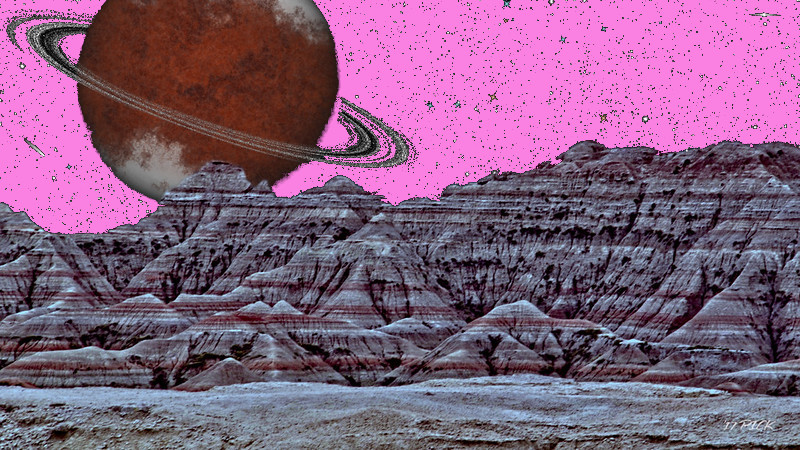

The Adventure Begins
====================

.. admonition:: Chapter overview

   The party assembles.  The ancient threat of the Godslayer is
   revealed.  The party is hired.  The portal is opened and the party
   steps through.  Arrival on the strange world of Jarn.

The players should have rolled up and leveled up 8th level
characters.  Being such high level adventurers, all or well known in
certain circles.  As such, it is known that they are present in the
town of Riverun.  Each player is approached by a deputy assistant
clerk in the office of Lady Galstott, Lady Mayor of Riverun.  Each is
offered compensation for consulting with the town officials on a
possible job requiring noted adventurers.

Some things to consider to add flavor to the initial encounter:

+ Do the PCs know one another?
+ Are any of the PCs of the Lathander or Moradin faiths?
+ Are the PCs in need of a job?  Or just looking for adventure?  Some
  other motivation?

Each PC in turn will be taken to the Sanctuary of Lathander, the God
of the Dawn, in the Hilltop district of Riverun.  They will be lead
into the nave of the Sanctuary where a large, stout wooden table is
set up and the town officials are waiting for the adventurers.  Each
PC is given a coin purse with 25gp simply for attending.  Most of the
town officials have mugs of hot beverage in front of them.  Drinks and
snacks are offered.  Drink options include tea, coffee, small beer,
very cold water, and fresh pressed early season apple cider.  Snack
include empanada-like things with mutton, bowls with cheese cubes and
nuts, and a variety of sliced fruits.

Town Officials
--------------

+ Lady Galstott
+ Her assistant, Violenne, halfling female
+ Her sheriff of the Guard, Jimmer Valesse, human male
+ Her wizard, Kenersley, male dwarf
+ High Priest of the Sanctuary of Lothander
+ Attendants to High Priest
+ Head Stonemason of the Temple of Moradin
+ Attendants to Head Stonemason

Meet with the Town Officials
----------------------------

Once all of the PCs arrive and have received their coin purse and been
offered refreshments, the High Priest begins.

.. _fig-lathander:

   The interior of the Sanctuary of Lathander.  `Source
   <https://www.deviantart.com/therealfroman/art/UDK-The-Cathedral-377066382>`__
   by `TheRealFroman <https://www.deviantart.com/therealfroman/gallery>`__

"Do any of you know of the story of Loviatar's Godslayer?"  Allow a
history roll, but the DC is very hard: 22.  If anyone passes, the
story to follow is exactly as the PC knows it.

"Two thousand years ago, my order, the followers of the Dawn Father,
came into conflict with a cult venerating Loviattar, god of pain and
torure.  Somehow, these cultists managed to gain the knowledge to
create a Godslayer, a massive construct imbued with unearthly powers
and capable of destroying divine beings.  This Godslayer was directed
to find and slay Lathander.

"Lore of that time is patchy and much of our knowledge is lost.  We
know that the Godslayer was loosed onto our world and that it caused
massive destruction in its hunt for the Dawn Father.  Eventually the
cult directing its actions was vanquished, the cults adherents were
slain, and the construct was banished from our world.

"We know that the Godslayer was not, itself, destroyed, only that it
was sent away from this realm.  Our records do not say who banished
the construct nor where it went.

"In recent decades we have been hearing whispers of shadowy groups
searching for the Godslayer's resting place.  As these whispers became
more common and more reliable in their source, we in the Community of
the Dawn Father have stepped up our efforts on many fronts.  Some of
my peers have trained scholars and archivists to search the libraries
of the world for information.  Others have turned to mysticism and
divination to learn more.  

"We here in Riverun have taken another approach.  With the material
aid and support of the town and of our friends in the Temple of
Moradin, we have partnered with arcane societies of the region to
create an arcane portal capable of traversing the boundaries between
realms, capable of transporting individuals to virtually any location
in the multiverse.

"This portal is secured in the catacombs beneath this very Sanctuary.

"We have a recent, credible lead on a location for the Godslayer.  We
are looking for a band of adventurers to step through the portal,
investigate the strange land that lies on the other side, search for
any information regarding the existance and state of the Godslayer,
and return to us with that information."

.. subfigure::  AB
   :layout-sm: AB
   :gap: 8px
   :subcaptions: above
   :name: fig-town_meeting
   :class-grid: outline

   .. image:: ../_static/distant_moon/meet_town_leaders_1.jpg

   .. image:: ../_static/distant_moon/meet_town_leaders_2.jpg

   Setup for meeting with town leaders in nave of Lathander temple.
   Lady Galstatt is at the head of the table with Violenne behind
   her.  To her left and right are Kenersley and Jimmer to her sides.
   6 Guards flank the room.  In the middle of the table are the two
   priests and their attendants.

Some details for the ensuing conversation
~~~~~~~~~~~~~~~~~~~~~~~~~~~~~~~~~~~~~~~~~

+ The PCs are offered 200 gp each traveling money for accepting the job (the
  money will not be all that useful once there, but players do like
  gold...) 

+ The PCs are offered 100 pp each upon return and 250 pp each if they
  return with substantive information.  That's A LOT of money.  The
  town will make no claim on any loot they bring back.  What they find
  is theirs.

+ Those present do not know much about the world on the other side.
  They describe a strange land called Jarn of pink skies and blue
  trees.  None of those present have been through the portal.

+ This gang is the third group commissioned to venture into the world.
  The first group's goal was to station a Dreamwalker in some
  situation where she could survive for the long term.  Two of her
  companions chose not to return, instead choosing to continue
  exploring Jarn.  While they have not been seen since, the
  Dreamwalker assures that they are still alive. Her final companion
  was seriously injured, returned through the portal, and passed away
  soon after.

* Before the fourth companion died, he spoke fondly of the village
  where the Dreamwalker took residence.  His descriptions of the
  inhabitants of the village were a bit strange.  He spoke of strange
  creatures but in a way that made little sense.

* The town officials receive word from the Dreamwalker from time to
  time by stationing a local who is psionically receptive while
  sleeping near the open portal.  More often than not, the Dreamwalker
  will communicate with the Sleeper, but the separation of the portal
  makes that communication vague and poorly informative.

+ In short, don't give up too much.  The discovery is the fun of the
  adventure.

+ The second party never returned.  Through the Sleeper, the
  Dreamwalker reported that the second party ran afoul of another
  group, possibly a group of elves, and were killed in some sort of
  street fight.  Again, the details are vague.

Payment
~~~~~~~

Up front, each party member is given:

+ 200 gp
+ 3 greater potions of healing (4d4+4)

Upon return, each party member will receive:

+ 100 pp
+ keep any loot found along the way

The task
--------

#. Go through the portal.  The path to the Dreamwalker is in the
   direction of the larger of the two visible mountain ranges.  The
   Dreamwalker should contact you soon upon arrival when you are
   sleeping.  She will provide more directions.

#. Meet up with the Dreamwalker to see if she has any new information
   or instructions as to the location of the Godslayer.

#. Follow up on any leads the Dreamwalker provides.

#. If any actionable information about the location and disposition of
   the Godslayer can be found, superb!  That is enough to earn the
   full commission.

#. There is no expectation that the Godslayer would be destroyed by
   the party.  If the Godslayer is functioning, engaging with it is
   certainly not within the scope of the commission and would almost
   certainly be suicidal.

#. If the party finds the Godslayer, take whatever actions seem
   appropriate.  That will be entirely the party's decision.

.. admonition:: Getting back

   The wizard gives the party a rod, explaining that it can be pressed
   against whatever forms the portal on the other side to activate the
   portal.  Either the warlock or the arcane trickster should be able
   to do this.  That will open the portal, allowing the team to step
   through, back into this room.

   Why are three casters needed to open the portal on this side?
   Well, the device on the other side is part of an ancient network of
   such things.  This is a recently created device which forces its
   way into the network.  Opening the portal is much easier from the
   other side, using the ancient device.  To say that another way |nd|
   the portals are made out of uncut, locally sourced, organic plot
   device.

The portal chamber
------------------

The party is taken into the catacombs below the Sanctuary.  The
chambers and tunnels go deep into the rock, generally northward, away
form the river.  (The Temple of Moradin occupied most of the central
area of the hill Riverun sits upon.  These two spaces were cleverly
carved by the dwarves to be mostly separate, although passages between
them do exist.)

The portal chamber is a simple room, 40 feet by 40 feet with vaulted
ceilings up to 50 feet high.  At the center is a runic circle carved
into the floor with a 20 foot tall stone arch at its center.  There is
incense, candles, flowers, herbs and spices, small bowls of liquids,
all kinds of weird magical stuff all over the place.  Three people you
recognize as being a druid, a sorcerer, and a cleric are going through
some kind of preparations.  Each does all kinds of weird, creepy stuff
appropriate to that kind of caster.

Once they are ready, they ask the party to step into the circle. They
explain that each will channel magic -- arcane, divine, and druidic
-- into the arch.  In time, portal will begin to glow.  Once a
shimmering blue sheet of light extends over the arch, step through.  

That's it.

Spell casters:

+ **Sorcerer**: elven female
+ **Druid**: ambiguous ancestry female
+ **Cleric**:  dwarven male

.. _fig-portal:
.. figure::  ../_static/distant_moon/portal_chamber.jpg
   :target: ../_static/distant_moon/portal_chamber.jpg
   :width: 75%
   :align: center

   The portal chamber after the three casters have opened the portal.

The other side
--------------

Ask for DC15 CON saves.  Those that fail, vomit upon arrival and have
the poisoned condition.  That won't matter, but it will freak out the
players.  Freaking out the players is very important at this stage.
You are trying to establish that they are very much not in Kansas
anymore.

Welcome to Jarn (although it will be a while before that learn that
name).

They have emerged from the portal on a windswept mountain top covered
with wispy snow drifts.  It is cold here, uncomfortable but not
bitterly cold.  They are in a circle of menhirs arranged at the
highest point of this mountain top.  The portal is on the side of one
of the menhirs and is beginning to fade away.

In two directions the players can see mountain ranges through somewhat
hazy skies.  Both mountain ranges are about 30 miles distant.  Compass
directions don't have a meaning, but to give a sense of orientation,
if one mountain range is in a westerly direction, the other is in a
southeasterly direction.  But, as we will see, there is not sunrise or
sunset to set the cardinal directions.

In the direction of the larger mountain range, the party can see that
the landscape is split by a massive ravine cutting a straight line and
extending to the horizon in both directions.

The horizon is the next weird bit.  It is awfully close.  From the
vantage point of this mountain top, a lot of horizon can be seen.  It
curves weirdly fast and does not seem to extend as far away as it
should.

The sky is a bright pinkish hue.  Coral colored clouds drift by here
and there.  There is plenty of light, but the light is far more
diffuse than the PCs are used to.  Shadows are small and indistinct,
as the light seems to come from all directions.  In one direction in
the sky, there is a bright blue light.  It looks kind of like the sun,
but it is too small, not bright enough, and the wrong color.

None of that counts as the weirdest thing.

The weirdest thing is the enormous purple disk in the sky which is the
source of the indistinct light.  It is a huge circle with an arching
line passing in front of it.

.. _fig-planet:

   Esta Kareki.  `Source
   <https://www.flickr.com/photos/maspick/36989808113>`__

The players are on a moon orbiting a Saturn-like planet.

From here, the path is down hill, towards the ravine.

On the trail
------------

We need to roll some dice to start the adventure, so there will be an
encounter on the path down hill towards the river.

The path goes through a sort of badlands, with plenty of boulder
fields and mesa |nd| plenty of places for the monsters to hide.

.. admonition:: Encounter

   2 fragrites from Creature Codex p. 164

